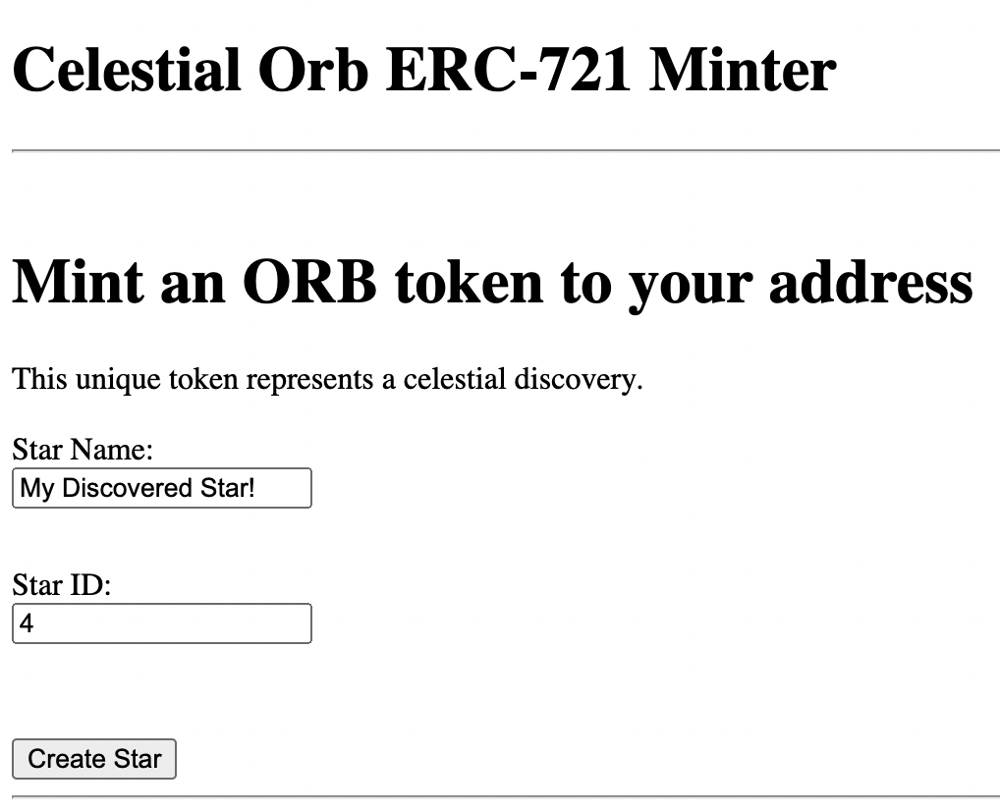
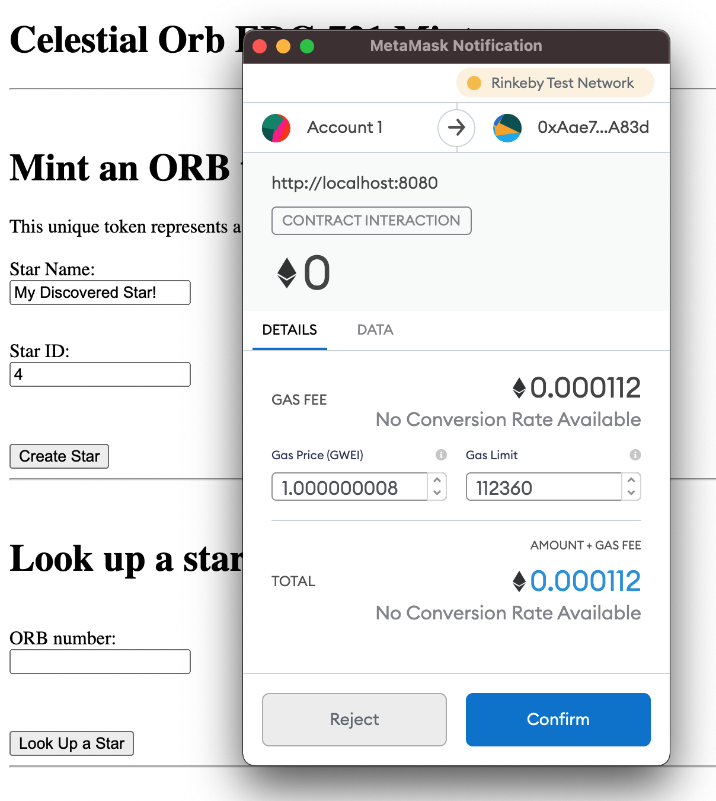
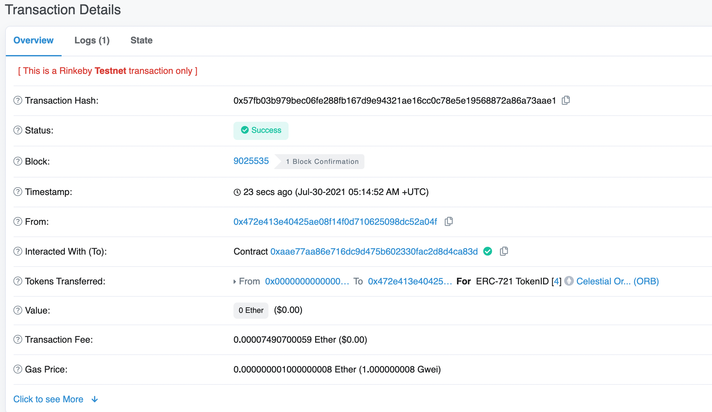
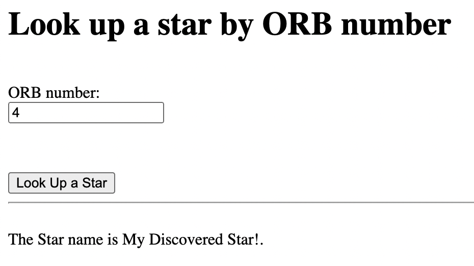

# ERC-721 CELESTIAL ORB TOKEN (ORB)

The ORB token is a unique collectible ERC-721 standard token that represents celestial objects in the sky. Anyone participating in
the Rinkeby network can mint ORB tokens to their wallet to commemerate their discoveries.

### Dependencies & Requirement
* Truffle v5.4
* OpenZeppellin 2.3
* Metamask
* NodeJS

### Instructions
1. Clone repository and `npm install`
2. [Get Rinkeby testnet funds](http://rinkeby-faucet.com/)
3. Compile and migrate the smart contracts: `truffle compile` and `truffle migrate --network rinkeby`
4. Serve the local webpage `npm run dev`

## How to mint your ORB token
 
Enter a name for the celestial object and select a unique identifier number an ORB token. The identifier number of the token must be completely unique in order
to successfully process. 

After clicking submit, Metamask will prompt to confirm the transaction.

 

Broadcast the transaction to Rinkeby using Metamask. The transaction takes 15-30 seconds to be confirmed by the blockchain.

You can view the status of your transaction by using the [Rinkeby explorer](https://rinkeby.etherscan.io/).
 

Once the transaction has been confirmed by Rinkeby, the ORB token will be minted to your address and can be looked up using its unique ID. Enter the ID into the box to recall the detail
of the unique token. See what other mysterious tokens you can find!

 

### Deployed Rinkeby Token Address 
0xAae77AA86e716Dc9d475B602330fAc2D8D4CA83d 

### FAQ
* Why is Metamask throwing an exception when I mint a token? 
The ORB identifier must be unique. If the ID is already taken, a duplicate token cannot be minted.

* Can I send ORB tokens to my friends? 
Yes, there is functionality to send and exchange ORB tokens, however these currently do not exist in the front end and
must be called from the contract directly.